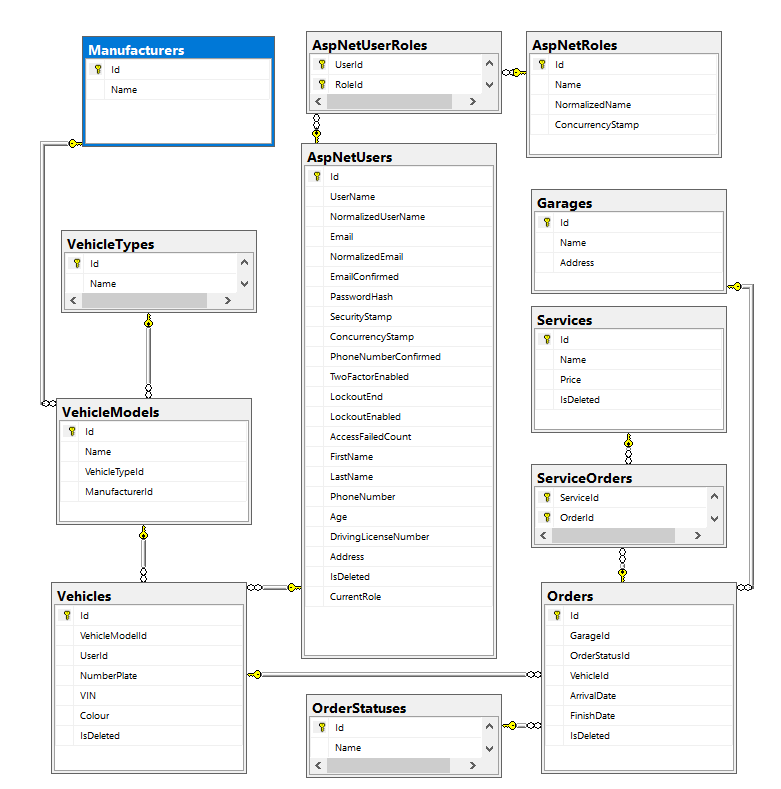
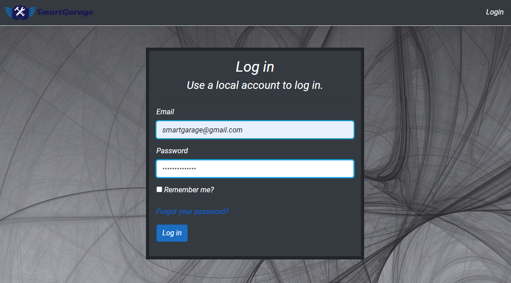
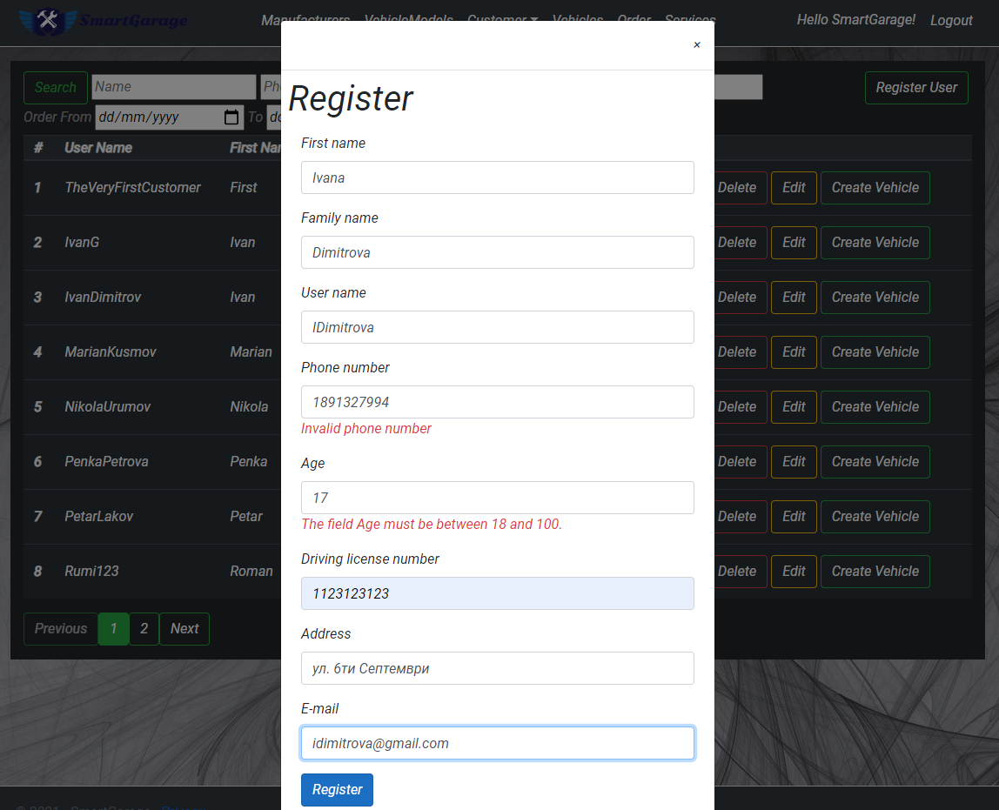
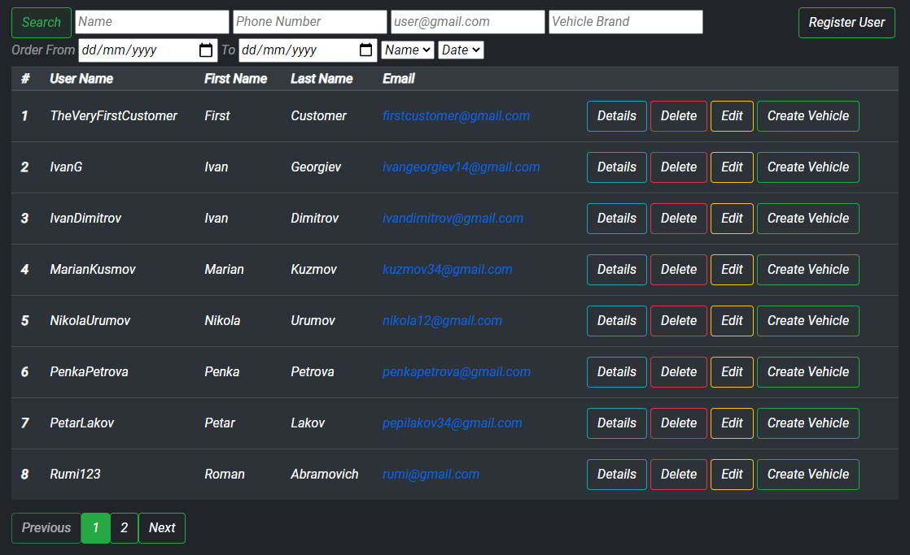
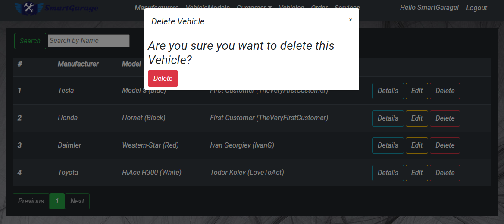
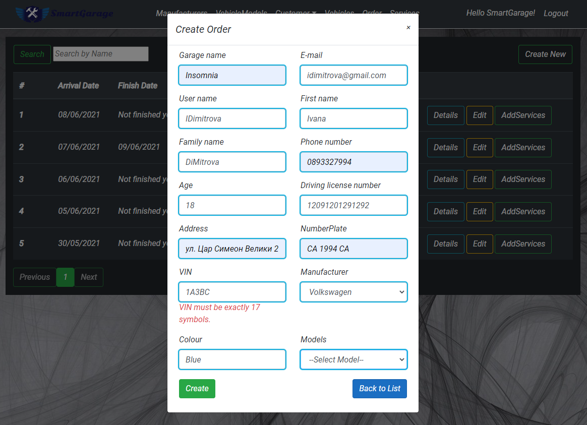
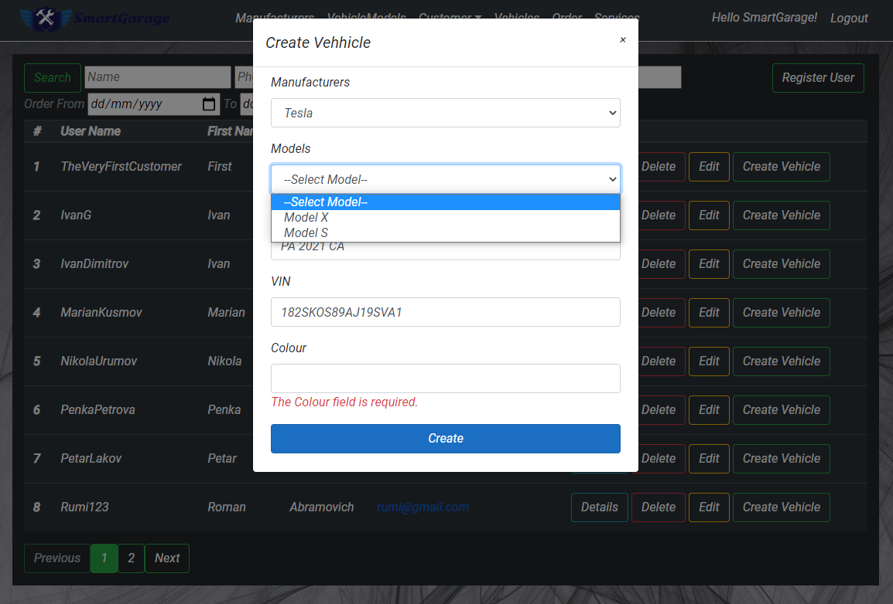

# SmartGarage

SmartGarage is a web application that enables the owners of an auto repair shop
to manage their day-to-day job. New customer walks in the shop and explains what 
the issue is with his vehicle and an employee creates a new personal vehicle in the aplication.
When the vehicle is created the employee creates a new
order that includes the newly created vehicle, as well as all the service procedures that
need to be performed (oil change, brake fluid change…). He receives
 email, that contains information about his automatically generated login information.
 When the car is ready to pick up customer receives another automatically generated email with
 invoice, containing the total sum that he must
pay along with every service procedure that was performed on his vehicle. 

- The project relies on 1 external API to function:
  
[Fixer API](https://fixer.io/documentation) - Source for Currency convert.
## Hosted Address:

https://smartgaragetp.azurewebsites.net/

## Installation

### Prerequisites
The following list of software should be installed:
- [SQL Server 2019](https://www.microsoft.com/en-us/sql-server/sql-server-downloads)
- [.NET 3.1](https://dotnet.microsoft.com/download/dotnet/3.1)

### Clone
- Clone or download the project on your local machine using `https://gitlab.com/group11-plamen-todor/smart-garage`
- All the `code` required to get started

### Setup REST API
- Navigate to the SmartGarage folder (e.g. cd /SmartGarage)
> Run solution file (SmartGarage.sln)
- Database
> updates the database to the last migration
```Dos
dotnet ef database update --project SmartGarage.Data
```
> Data will be seed within the database is update.
> Open **new** terminal and run the project
```Dos
dotnet run --project SmartGarage.Web
```
> Open your browser and navigate to http://localhost:5000/swagger/index.html.

### Setup MVC aplication
Run solutin file (SmartGarage.sln)
- In your browser navigate to http://localhost:5000
```Dos
- Admin access
Email: smartgarage@gmail.com
password: SmartGarage123

- Employee access
Email: petar@test.com
password: Petar123

- Customer access
Email: firstcustomer@gmail.com
password: Customer123
```


## Technologies

- ASP.NET 3.1
- ASP.NET Identity
- Entity Framework Core 5
- MS SQL Server
- HTML
- CSS
- Bootstrap
- Azure Cloud Services
- jQuery
- Ajax

## Database Schema


## API Documentation

- [DeliverIt API Documentation](https://app.swaggerhub.com/apis-docs/Team11_PT/SmartGarage_API/v1)
# Team 11

-  [Gitlab Board](https://gitlab.com/group11-plamen-todor/smart-garage/-/boards)
  
- Todor Vasilev - [GitLab](https://gitlab.com/TodorVasilev), [LinkedIn](https://www.linkedin.com/in/todor-vasilev/)

- Plamen Velikov - [GitLab](https://gitlab.com/plamen.velikov), [LinkedIn](www.linkedin.com/in/plamenvelikov)

# Application Screenshots
>### Log in Form


<p>&nbsp;</p>

>###  Home page


<p>&nbsp;</p>

>###  Registration Form for user


<p>&nbsp;</p>

>###  Customer table


<p>&nbsp;</p>

>###  Delete Vehicle Popup


<p>&nbsp;</p>

>###  Delete Vehicle Popup


<p>&nbsp;</p> 

>###  Create Vehicle Popup


